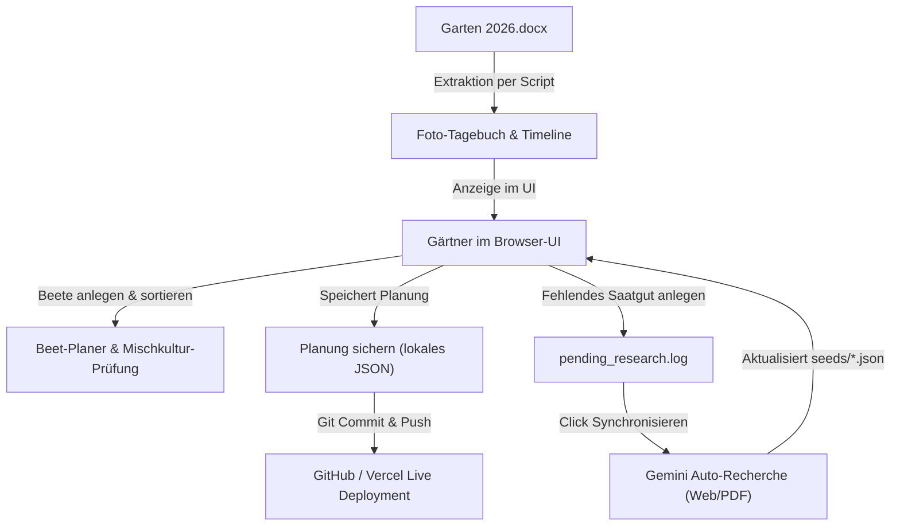

# GartenPlaner: Architektur & Workflows (Stand: Juni 2026)

Dieses Dokument beschreibt die interne Dateistruktur, die System-Architektur sowie die Kern-Workflows der **GartenPlaner**-Webanwendung.

---

## 📂 1. App-Struktur (Dateisystem)

Das Projekt basiert auf **React (TypeScript)**, gebündelt mit **Vite**, gestylt mit **CSS** und deployt über **GitHub & Vercel**.

```
garten-planer/
├── public/
│   ├── images/                        # Enthält alle extrahierten Gartenfotos (image1.jpg - image41.jpg)
│   ├── 2024_Aussaatkalender-Bingenheimer-Saatgut.pdf
│   └── Mischkulturen.pdf
├── src/
│   ├── seeds/                         # Einzelne JSON-Dateien pro Pflanzensorte
│   │   ├── initial_seeds.json
│   │   ├── lauch.json
│   │   ├── zucchini.json
│   │   └── ...
│   ├── App.css                        # Styling (Garten-Farbpalette, Timeline, Lightbox, Mobile-Layout)
│   ├── App.tsx                        # Hauptkomponente (State-Management, UI-Rendering, Modals)
│   ├── beds_data.json                 # Aktuelle 14-Beete-Konfiguration (inkl. Gewächshaus)
│   ├── data.ts                        # Lädt dynamisch alle seeds/*.json-Dateien
│   ├── documentation_data.json        # Chronologisches Tagebuch 2026 (Text + Fotos)
│   └── main.tsx                       # React-Einstiegspunkt
├── index.html                         # HTML-Grundgerüst
├── package.json                       # npm-Abhängigkeiten & Build-Skripte
├── tsconfig.json                      # TypeScript-Konfiguration
└── vite.config.ts                     # Vite-Konfiguration & Custom API-Server-Plugins
```

---

## 🔄 2. Die 4 Kern-Workflows



### A. Planungs- & Mischkultur-Workflow
* **Ziel:** Zusammenstellung von Beeten mit optimalen Pflanzenkombinationen zur Ertragssteigerung und Schädlingsabwehr.
* **Logik:** In `App.tsx` wird für jede Reihe in einem Beet die Nachbarschaftsbeziehung zu den anderen Reihen berechnet. 
  * `goodNeighbors` färben den Hintergrund grün ein.
  * `badNeighbors` lösen eine rote Warnung aus.

### B. Foto-Tagebuch- & Timeline-Workflow
* **Ziel:** Visualisierung des Wachstumsfortschritts über die Saison 2026 hinweg.
* **Logik:** Text und 41 Bilddateien wurden aus `Garten 2026.docx` extrahiert. Die Daten liegen in `src/documentation_data.json` und werden über einen vertikalen Timeline-Stream angezeigt. Ein Klick auf ein Foto öffnet ein Lightbox-Modal, das über Tastatur oder Klick (Pfeiltasten) ein Vor- und Zurückblättern ermöglicht.

### C. Cloud-Sicherungs- & Deployment-Workflow
* **Ziel:** Speichern lokaler Änderungen der Beetplanung und Aktualisierung auf dem Vercel-Server.
* **Ablauf:**
  1. Änderungen an Beeten im UI vornehmen (wird im `localStorage` gehalten).
  2. Klick auf **Planung sichern** sendet eine POST-Anfrage an den lokalen API-Server, welcher `src/beds_data.json` überschreibt.
  3. Den KI-Agenten im Chat anweisen: *"push"*.
  4. Die aktualisierten Daten werden auf GitHub gepusht, was den automatischen Vercel-Build auslöst.

### D. KI-Recherche- & Synchronisations-Workflow
* **Ziel:** Automatisches Ausfüllen fehlender Pflanzdaten (Anbaukalender, Nachbarschaften).
* **Ablauf:**
  1. Fehlende Daten werden im UI markiert.
  2. Der Hintergrund-Watcher schreibt diese in `pending_research.log`.
  3. Klick auf **Synchronisieren** signalisiert Gemini, das Web sowie lokale PDFs nach passenden Pflanzdaten zu durchsuchen.
  4. Die gefundenen Parameter werden direkt in die jeweilige Pflanz-JSON in `src/seeds/` geschrieben.

---

## 🛠️ 3. Wichtige Terminal-Befehle

| Befehl | Beschreibung |
| :--- | :--- |
| `npm run dev` | Startet den lokalen Vite-Entwicklungsserver unter `http://localhost:5173/`. |
| `npm run build` | Kompiliert das Projekt in statische Dateien im Ordner `dist/`. |
| `node watcher.js` | Startet das Hintergrund-Monitoring für fehlende Saatgut-Daten. |
| `git push` | Lädt den aktuellen Stand der Planung und des Tagebuchs auf GitHub hoch. |
